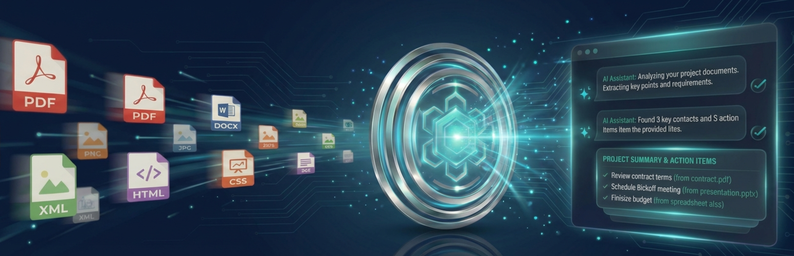
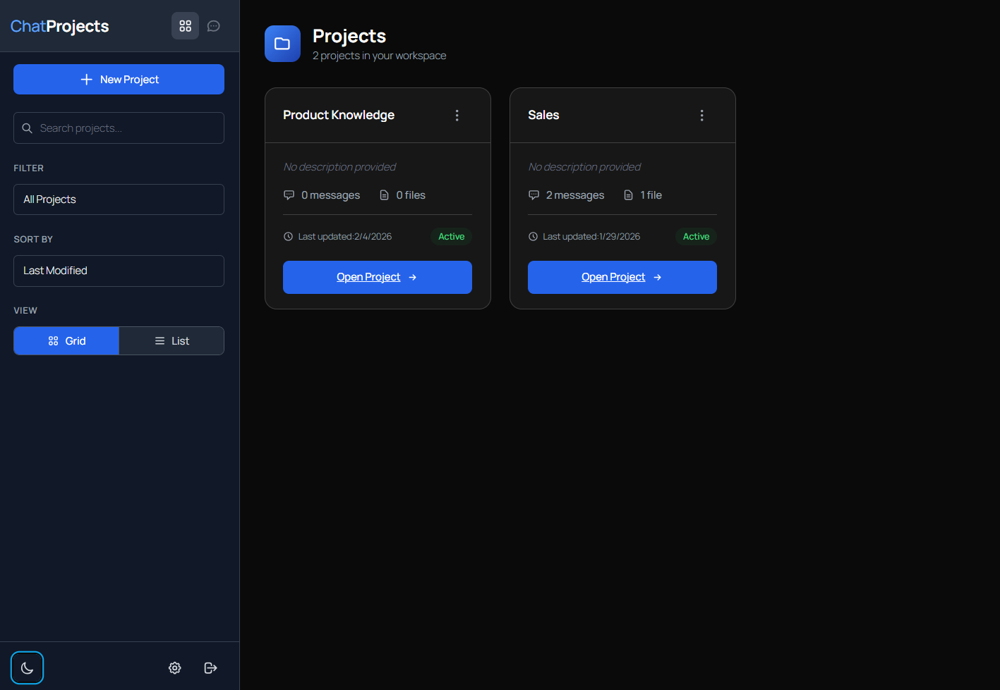
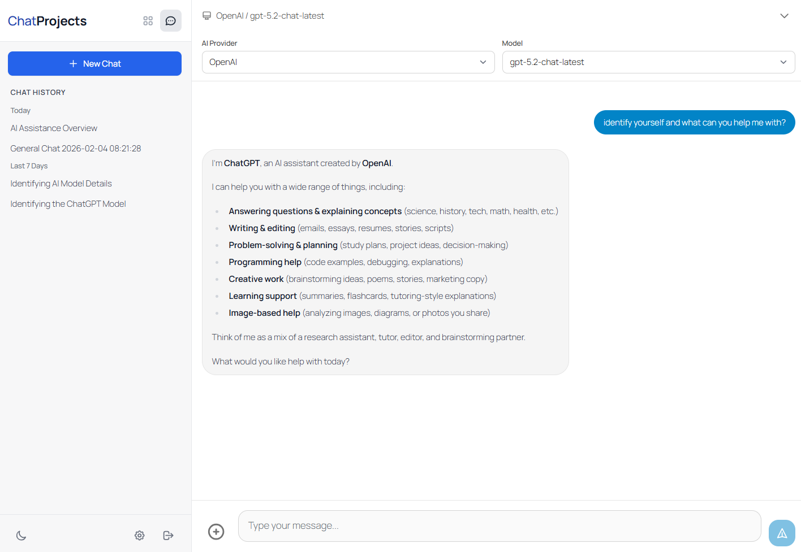
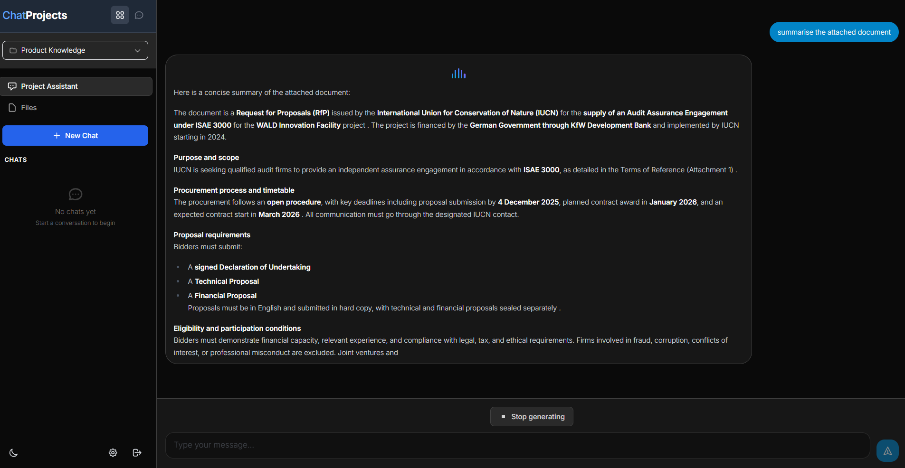
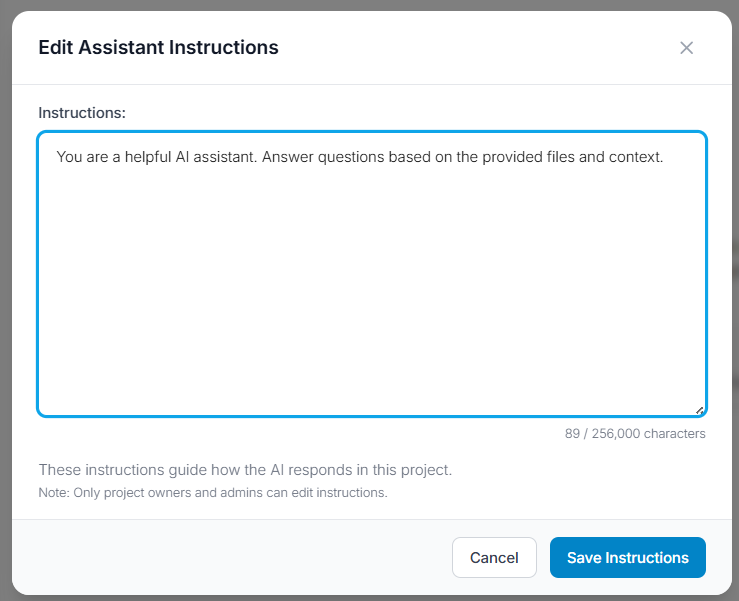
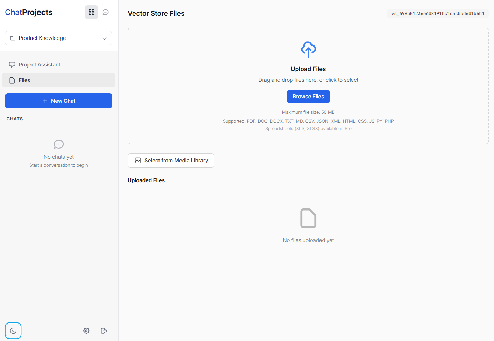
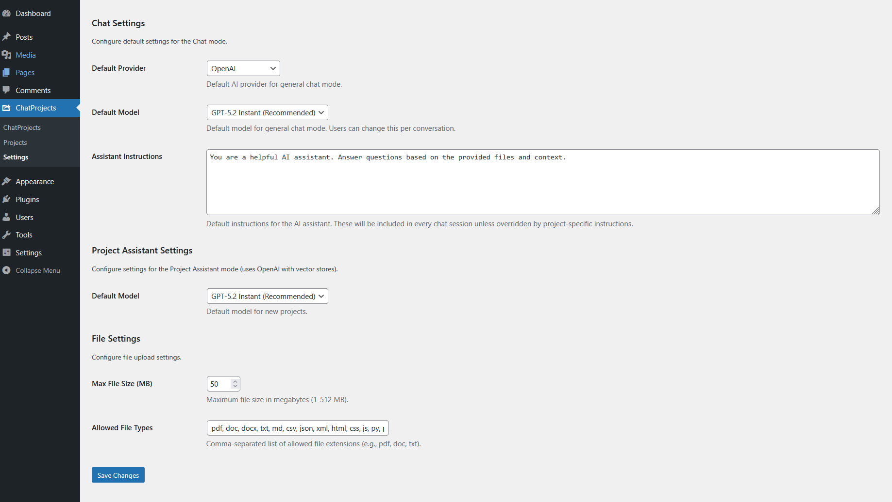

# ChatProjects - AI Chat for WordPress

[](https://wordpress.org/plugins/chatprojects/)
[](https://wordpress.org/plugins/chatprojects/)
[](https://wordpress.org/plugins/chatprojects/)
[](https://www.gnu.org/licenses/gpl-2.0.html)

**ChatProjects** is the easiest way to chat with your files and documents in WordPress. AI-powered project chat with OpenAI Responses API vector store backend for intelligent file search.

Use your own API keys to chat with multiple AI providers including OpenAI (GPT-5.2), Anthropic (Claude), Google (Gemini 3 Pro), Chutes (DeepSeek), and OpenRouter.

## Demo

[](https://youtu.be/3BC-_2wmmCM)

> Click the image above to watch the demo on YouTube

## Key Features

- **Multi-Provider Chat** - Chat with GPT-5.2, Claude 4.5, Gemini 3, DeepSeek, and 100+ models via OpenRouter
- **Project Management** - Create projects with OpenAI's file search capability
- **File Upload** - Upload documents (PDF, TXT, DOC) to your project's vector store
- **Custom Instructions** - Set custom assistant instructions for each project
- **Shared Chatbots** - Create project-based chatbots that can be shared with your team
- **Modern Interface** - Clean, responsive chat interface with dark mode support
- **Embeddable** - Use shortcodes to embed the full application on any page
- **Privacy First** - Your API keys stay on your server, not ours

## Screenshots

### Project Management Dashboard


### Main Chat Interface


### Project Assistant with Vector Store Chat


### Edit Project Assistant Instructions


### Upload Files to Vector Store


### Settings & API Keys


## Supported AI Providers

| Provider | Models |
|----------|--------|
| **OpenAI** | GPT-5.2, GPT-5 Mini, GPT-4.1, GPT-4o, o4-mini, o3-mini |
| **Anthropic** | Claude Sonnet 4.5, Claude Haiku 4.5, Claude Opus 4.5 |
| **Google Gemini** | Gemini 3 Pro, Gemini 3 Flash, Gemini 2.5 Pro, Gemini 2.5 Flash |
| **Chutes** | DeepSeek V3, DeepSeek R1, Qwen, Mistral, Llama |
| **OpenRouter** | 100+ models from various providers |

## Installation

1. Download from [WordPress.org](https://wordpress.org/plugins/chatprojects/) or upload the `chatprojects` folder to `/wp-content/plugins/`
2. Activate the plugin through the **Plugins** menu in WordPress
3. Go to **ChatProjects > Settings** to add your API keys
4. Access the interface at `https://yourdomain.com/chatprojects/` or add the `[chatprojects_main]` shortcode to any page
5. Start chatting!

### Shortcodes

```
[chatprojects_main]
[chatprojects_main default_tab="chat" height="80vh"]
```

## Requirements

- WordPress 5.8 or higher
- PHP 7.4 or higher
- At least one API key (OpenAI, Anthropic, Gemini, Chutes, or OpenRouter)

> **Note:** An OpenAI API key is required for Projects and document chat (vector store) features.

## FAQ

**Do I need all 5 API keys?**
No! You only need one API key to start chatting. Add more providers as needed.

**Where are my API keys stored?**
Your API keys are stored encrypted in your WordPress database. They never leave your server.

**What file types can I upload?**
PDF, DOC, DOCX, TXT, MD, CSV, JSON, XML, HTML, CSS, JS, PY, PHP

**Can I use this on a client site?**
Yes! ChatProjects is GPL licensed. You can use it on any WordPress site.

## Support

- [WordPress.org Support Forum](https://wordpress.org/support/plugin/chatprojects/)
- Email: support@chatprojects.com
- [Report Issues](https://github.com/chatprojects-com/chatprojects/issues)

## License

This project is licensed under the GPL v2 or later - see the [LICENSE](https://www.gnu.org/licenses/gpl-2.0.html) for details.
